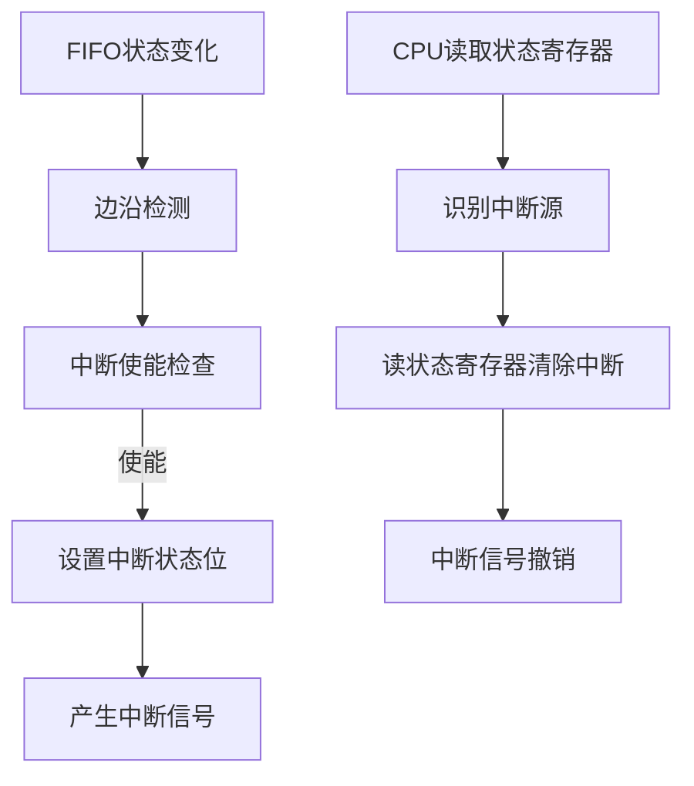

# ARINC429 IP核命令状态寄存器模块说明

## 模块概述
`命令状态寄存器`模块是ARINC429 IP核的核心控制模块，负责管理发送/接收FIFO、配置工作模式、监控状态并产生中断信号。通过Wishbone总线接口与外部控制器通信。最新版本改进了中断处理机制，使用边沿检测代替电平检测。

## 寄存器映射

| 地址 | 名称   | 类型 | 描述                  | 位定义 |
|------|--------|------|-----------------------|--------|
| 0x0  | FIFO   | R/W  | FIFO数据寄存器        | - 写操作：当发送FIFO非满时写入数据 - 读操作：当接收FIFO非空时读取数据 |
| 0x1  | CMD    | R/W  | 命令寄存器            | 见下表详细说明 |
| 0x2  | TXSTS  | R/W  | 发送状态/中断寄存器   | 见下表详细说明（读操作清除中断） |
| 0x3  | RXSTS  | R/W  | 接收状态/中断寄存器   | 见下表详细说明（读操作清除中断） |

## 命令寄存器 (CMD)

| 位号 | 名称         | 类型 | 描述                          | 复位值 |
|------|--------------|------|-------------------------------|--------|
| 0    | tx_ena        | RW   | 发送使能 (1=使能)             | 0      |
| 1    | tx_hi_spd   | RW   | 发送速率 (1=高速, 0=低速)     | 0      |
| 2    | tf_rs       | RW   | 发送FIFO复位 (1=复位)         | 0      |
| 3    | lloop_ena     | RW   | 本地环回使能 (1=使能)         | 0      |
| 4    | rx_ena        | RW   | 接收使能 (1=使能)             | 0      |
| 5    | rx_hi_spd   | RW   | 接收速率 (1=高速, 0=低速)     | 0      |
| 6    | rf_rs       | RW   | 接收FIFO复位 (1=复位)         | 0      |
| 7    | rloop_ena    | RW   | 远程环回使能 (1=使能)         | 0      |
| 8    | tx_et_ie  | RW   | 发送FIFO空中断使能            | 0      |
| 9    | tx_fl_ie   | RW   | 发送FIFO满中断使能            | 0      |
| 10   | tx_ae_ie | RW   | 发送FIFO几乎空中断使能        | 0      |
| 11   | tx_af_ie  | RW   | 发送FIFO几乎满中断使能        | 0      |
| 12   | rx_et_ie  | RW   | 接收FIFO空中断使能            | 0      |
| 13   | rx_fl_ie   | RW   | 接收FIFO满中断使能            | 0      |
| 14   | rx_ae_ie | RW   | 接收FIFO几乎空中断使能        | 0      |
| 15   | rx_af_ie  | RW   | 接收FIFO几乎满中断使能        | 0      |
| 31:16| -            | -    | 保留                          | 0      |

## 发送状态寄存器 (TXSTS)

| 位域      | 名称      | 类型 | 描述                     |
|-----------|-----------|------|--------------------------|
| [15:0]  | tf_cn    | RO   | 发送FIFO当前数据数量     |
| [16]    | tf_et  | RO   | 发送FIFO空标志 (1=空)    |
| [17]    | tf_fl   | RO   | 发送FIFO满标志 (1=满)    |
| [18]    | tf_ae | RO   | 发送FIFO几乎空标志       |
| [19]    | tf_af  | RO   | 发送FIFO几乎满标志       |
| [20]    | tx_et_irq | RO | 发送空中断状态 (1=发生)  |
| [21]    | tx_fl_irq  | RO | 发送满中断状态 (1=发生)  |
| [22]    | tx_ae_irq| RO | 发送几乎空中断状态 (1=发生) |
| [23]    | tx_af_irq | RO | 发送几乎满中断状态 (1=发生) |
| [31:24] | -         | RO   | 保留 (读为0)             |

## 接收状态寄存器 (RXSTS)

| 位域      | 名称      | 类型 | 描述                     |
|-----------|-----------|------|--------------------------|
| [15:0]  | rf_cn    | RO   | 接收FIFO当前数据数量     |
| [16]    | rf_et  | RO   | 接收FIFO空标志 (1=空)    |
| [17]    | rf_fl   | RO   | 接收FIFO满标志 (1=满)    |
| [18]    | rf_ae | RO   | 接收FIFO几乎空标志       |
| [19]    | rf_af  | RO   | 接收FIFO几乎满标志       |
| [20]    | rx_et_irq | RO | 接收空中断状态 (1=发生)  |
| [21]    | rx_fl_irq  | RO | 接收满中断状态 (1=发生)  |
| [22]    | rx_ae_irq| RO | 接收几乎空中断状态 (1=发生) |
| [23]    | rx_af_irq | RO | 接收几乎满中断状态 (1=发生) |
| [31:24] | -         | RO   | 保留 (读为0)             |

## 中断逻辑

### 中断检测机制
1. **边沿检测**：
   - 对FIFO状态信号进行边沿检测
   - 仅在状态变化时（上升沿）触发中断
   - 例如：当FIFO从非空变为空时触发空中断

2. **中断状态寄存器**：
    - `TXSTS[23:20]`：发送中断状态
    - `TXSTS[23:20]`：接收中断状态

### 中断清除机制
- **读TXSTS寄存器**：清除所有发送中断状态位
- **读RXSTS寄存器**：清除所有接收中断状态位

### 中断处理流程

### 总线接口时序
1. **当cyc_i和stb_i同时有效时启动传输**
2. **模块在下一个时钟周期产生ack_o响应**
3. **写操作**：
   - 地址0：当发送FIFO非满(tf_fl=0)时，数据写入发送FIFO(tf_di)
   - 地址1：数据写入命令寄存器(CMD)
4. **读操作**：
   - 地址0：当接收FIFO非空(rf_et=0)时，从接收FIFO读取数据(rf_do)
   - 地址1：读取CMD寄存器值
   - 地址2：读取TXSTS寄存器值，清除发送中断状态
   - 地址3：读取RXSTS寄存器值，清除接收中断状态

### 注意事项
1. 中断清除：读状态寄存器->清除中断
2. 边沿触发：中断仅在状态变化时触发一次
3. 状态读取：读取状态寄存器同时清除中断状态位
4. FIFO保护：
   - 写发送FIFO前检查满标志
   - 读接收FIFO前检查空标志
5. 中断使能：配置CMD寄存器后中断才会生效
6. 复位状态：
   - 所有寄存器复位值为0
   - 所有中断状态位复位后为0
   - 发送和接收功能默认禁用

---
#### Copyright (c) 2025 Tianjin Deepspace Smartcore Technology Co., Ltd.
#### 天津深空智核科技有限公司
#### https://www.zzkkip.cn
#### SPDX-License-Identifier: MIT
---